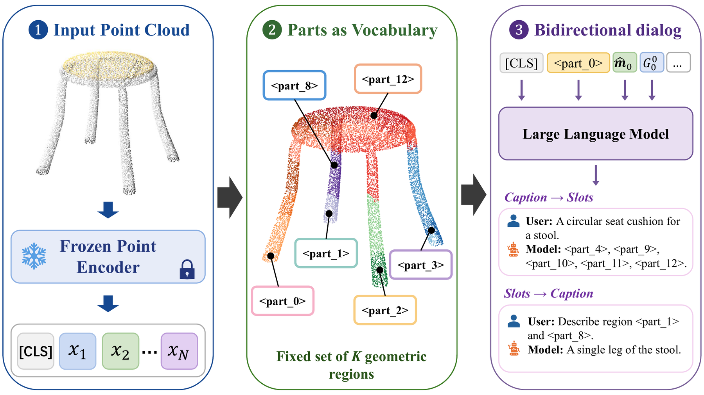
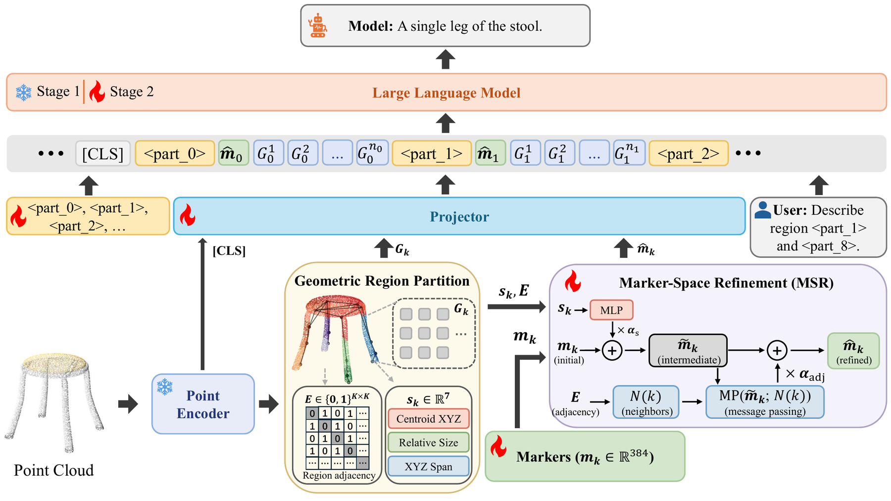

# 3D-PLOT-LLM: Part-Level Object Tokens for 3D Large Language Models

[](https://arxiv.org/abs/2606.19828)
[](https://neurips.cc/)
[](https://huggingface.co/jintangx/3D-PLOT-LLM-7B)
[](https://huggingface.co/datasets/jintangx/PartVerse-QA)
[](LICENSE)

Official implementation of **3D-PLOT-LLM** (NeurIPS 2026), by Jintang Xue, Xinyu Wang, Yixing Wu, Jingwen Chen and C.-C. Jay Kuo.

3D-PLOT-LLM makes the parts of a 3D object addressable from the language model's vocabulary, without any segmentation or box decoder. A frozen Point-BERT encoder's 512 patch tokens are partitioned into K=16 spatially coherent regions by a deterministic, training-free procedure; each region is prefixed with a learnable marker and a reserved vocabulary token `<part_k>`, and a lightweight Marker-Space Refinement (MSR) module conditions the markers on per-region spatial statistics and region adjacency. The LLM can then both read and emit part references. Fewer than one million parameters are added to PointLLM.

<p align="center"></p>

## Highlights

- Part addressing through vocabulary tokens, with no detector and no mask decoder.
- **PartVerse-QA**: 77,607 training pairs and 588 held-out queries (392 caption-to-slots, 196 slots-to-caption) built from PartVerse part annotations aligned to the PointLLM 8192-point Objaverse clouds.
- Whole-object captioning on Objaverse stays on par with PointLLM while part grounding becomes possible.

<p align="center"></p>

## News

- 2026-09: 3D-PLOT-LLM is accepted to NeurIPS 2026.
- 2026-06: Paper on arXiv.

## Contents

- [Installation](#installation)
- [Data preparation](#data-preparation)
- [Checkpoints](#checkpoints)
- [Evaluation](#evaluation)
- [Training](#training)
- [Building PartVerse-QA and the partition packs](#building-partverse-qa-and-the-partition-packs)
- [Reproducibility notes](#reproducibility-notes)
- [Citation](#citation)
- [Acknowledgement](#acknowledgement)

## Installation

The code builds on [PointLLM](https://github.com/OpenRobotLab/PointLLM) and keeps its dependency on a pinned transformers commit. The environment below is the one the paper's numbers were produced with (the full `pip freeze` is in `env_paper_original_freeze.txt`).

```bash
conda create -n plotllm python=3.10 -y
conda activate plotllm
pip install torch==2.10.0 torchvision==0.25.0 numpy==2.2.6
pip install "git+https://github.com/huggingface/transformers.git@cae78c46" tokenizers==0.12.1 \
    huggingface_hub==0.36.2 safetensors==0.7.0 accelerate==1.13.0 peft==0.18.1
pip install timm==0.4.12 open3d==0.16.0 scipy==1.15.3 einops==0.8.2 sentencepiece==0.2.1 easydict \
    shortuuid ftfy regex h5py termcolor plyfile tqdm pyyaml requests matplotlib scikit-learn pandas nltk rouge py-rouge openai
# training only
pip install deepspeed ninja flash-attn
# traditional caption metrics (SBERT / SimCSE) can live in a separate environment with a recent sentence-transformers
```

All scripts read their paths from `env.sh`, which also puts the repository on `PYTHONPATH`. Either export the variables in your shell or edit the defaults in that file. The prefix `bcp` in option names, config keys and the pack directory variable stands for Balanced Connected Parts, the code name of the region partition module:

| Variable | Meaning | Default |
|---|---|---|
| `PLOT_PYTHON` | interpreter for training, inference and the GPT judge | `python` |
| `PLOT_PYTHON_EVAL` | interpreter for SBERT / SimCSE / BLEU / ROUGE / METEOR | `$PLOT_PYTHON` |
| `POINTLLM_DATA` | folder with `objaverse_data/` (8192-point `.npy` files) and `anno_data/` | `data/pointllm` |
| `POINTLLM_CKPT_DIR` | folder with `PointLLM_7B_v1.1_init/` and `PointLLM_7B_v1.2/` | `checkpoints` |
| `POINT_BERT_CKPT` | Point-BERT weights | inside `PointLLM_7B_v1.1_init/` |
| `BCP_PACK_DIR` | K=16 partition packs (`packs_k16/` from the dataset archives) | `data/packs_k16` |
| `PARTVERSE_QA_DIR` | PartVerse-QA json files | `data/partverse_qa` |
| `PARTVERSE_ROOT` | PartVerse download with `text_captions.json` (only to rebuild the dataset) | `data/partverse` |
| `PARTVERSE_CACHE` | PartVerse per-point part ids (only to rebuild the dataset) | `$PARTVERSE_ROOT/cache_global_rgb_nn_partid` |
| `COMPAT_DATA` | 3DCoMPaT / GrIn data (only for Table 3) | `data/3dcompat` |

## Data preparation

1. **Objaverse point clouds and captions** (PointLLM release): download the 660K 8192-point clouds and the annotation files from [RunsenXu/PointLLM](https://huggingface.co/datasets/RunsenXu/PointLLM) and arrange them as `$POINTLLM_DATA/objaverse_data/*.npy` and `$POINTLLM_DATA/anno_data/*.json`, exactly as in the PointLLM instructions.
2. **PartVerse-QA** (ours): download from [https://huggingface.co/datasets/jintangx/PartVerse-QA](https://huggingface.co/datasets/jintangx/PartVerse-QA) into `$PARTVERSE_QA_DIR`. It contains the training pairs, the Stage 2 training sets, the held-out C2S and S2C queries, the held-out object ids, the object alignment parameters, and the K=16 partition packs (`packs_k16_eval.tar` for the evaluation objects, `packs_k16_partverse.tar` for all aligned objects); extract the archives into `$BCP_PACK_DIR`.
3. **Partition packs for all 660K Stage 1 objects** (only needed to retrain): generate them with `data_tools/partition_packs/launch_bcp_stage1_v3_cls.py` (see below); the output folder is used as `$BCP_PACK_DIR`.
4. **3DCoMPaT / GrIn** (only for Table 3): see `data_tools/compat_grin/`.

Prompts: training and evaluation use the short prompt templates printed in Appendix D of the paper, for example `Text: "..." Output only matching <part_n> tokens, comma-separated.` for caption-to-slots. The released json files use these templates; evaluating with a different wording changes the scores.

## Checkpoints

| Model | Description | Link |
|---|---|---|
| 3D-PLOT-LLM-7B (MSR, full) | the model used for all main tables | [https://huggingface.co/jintangx/3D-PLOT-LLM-7B](https://huggingface.co/jintangx/3D-PLOT-LLM-7B) |
| PointLLM_7B_v1.1_init | Stage 1 starting point (Vicuna-v1.5-7B + Point-BERT), from PointLLM | [RunsenXu/PointLLM_7B_v1.1_init](https://huggingface.co/RunsenXu/PointLLM_7B_v1.1_init) |
| PointLLM_7B_v1.2 | baseline used in the tables, from PointLLM | [RunsenXu/PointLLM_7B_v1.2](https://huggingface.co/RunsenXu/PointLLM_7B_v1.2) |

The released weights carry the licenses of their upstream components (Llama 2 community license for the Vicuna backbone; PointLLM weights are CC-BY-NC-4.0), so they are for non-commercial use. See [License](#license).

## Evaluation

Set `MODEL=/path/to/3D-PLOT-LLM-7B` after downloading the checkpoint.

Caption-to-slots and slots-to-caption on PartVerse-QA (greedy decoding for C2S; sampling with T=1.0, top-p 0.95, top-k 50 for S2C, 5 runs):

```bash
source env.sh
$PLOT_PYTHON pointllm/eval/eval_partverse_caption2slots.py --model_name $MODEL \
    --anno_path $PARTVERSE_QA_DIR/eval_c2s.json \
    --data_path $POINTLLM_DATA/objaverse_data --bcp_pack_dir $BCP_PACK_DIR
for run in 1 2 3 4 5; do
$PLOT_PYTHON pointllm/eval/eval_partverse_slots2caption.py --model_name $MODEL \
    --anno_path $PARTVERSE_QA_DIR/eval_s2c.json \
    --data_path $POINTLLM_DATA/objaverse_data --bcp_pack_dir $BCP_PACK_DIR \
    --temperature 1.0 --top_p 0.95 --top_k 50 --run_id $run
done
```

Whole-object captioning on Objaverse (200 objects, prompt 2, sampling, 5 runs):

```bash
$PLOT_PYTHON pointllm/eval/eval_objaverse.py --model_name $MODEL --task_type captioning --prompt_index 2 \
    --anno_path $POINTLLM_DATA/anno_data/PointLLM_brief_description_val_200_GT.json \
    --data_path $POINTLLM_DATA/objaverse_data --bcp_pack_dir $BCP_PACK_DIR --num_runs 5 --batch_size 1
```

Scoring: `pointllm/eval/traditional_evaluator.py --results_path <pred.json>` for BLEU, ROUGE, METEOR, SBERT and SimCSE; `pointllm/eval/evaluator.py` for the GPT-4o judge (needs `OPENAI_API_KEY`; the judge prompt is `eval_tools/gpt4o_judge_prompt.txt`); `eval_tools/compute_mesh_miou.py --pred <c2s_pred.json>` for the partition-agnostic mesh mIoU; `eval_tools/aggregate.py` for 5-run means. `eval_objaverse.sh` and `eval_partverse.sh` chain inference, scoring and aggregation for the checkpoints listed at the top of each script; they expect the released checkpoint under `$POINTLLM_CKPT_DIR/3D-PLOT-LLM-7B` and skip entries that are not present.

## Training

Stage 1 (alignment on the 660K Cap3D captions; trains the projector, the region markers and MSR with the LLM frozen; 2 GPUs):

```bash
bash scripts/train_stage1.sh
```

Stage 2 (adds the `<part_k>` tokens; instruction tuning on PointLLM 70K plus PartVerse-QA with full LLM fine-tuning, ZeRO-3):

```bash
bash scripts/train_stage2.sh
```

`scripts/train_stage2_no_partverse.sh` trains the no-PartVerse variant. `scripts/ablations/` holds the Stage 1 and Stage 2 scripts of every ablation row in the paper (grouping only, markers only, vocabulary only, markers without MSR, LSR, MSR plus LSR, the two MSR branches, PartVerse-QA data scaling, K=8), and `scripts/grin/` the 3DCoMPaT-GrIn fine-tuning of PointLLM and 3D-PLOT-LLM. Outputs go to `outputs/`.

## Building PartVerse-QA and the partition packs

- `data_tools/partition_packs/launch_bcp_stage1_v3_cls.py` computes the K=16 partition packs (patch features, region labels, adjacency, nested coarse levels) from Point-BERT patches.
- `data_tools/partverse_qa/`: `bcp_semantic_mapping.py` aligns PartVerse meshes to the Objaverse clouds and maps parts to region slots, `build_stage2_part_json.py` and `filter_stage2_part_json.py` build and filter the question-answer pairs, `merge_stage2_anno.py` merges them with the PointLLM instruction data, and `build_splits.py` builds the held-out split, the training pairs, the Stage 2 training set and the data-scaling subsets under the released file names. Paths are set in `default_paths.py` or through the environment variables above. Running `python -m data_tools.partverse_qa.build_splits` with `--filter_min_union_iou 0.5 --merge_seed 42 --fractions 0,0.15,0.25,full --pool_fractions 0.5,0.75` reproduces the released PartVerse-QA split files byte for byte.

## Reproducibility notes

- Greedy caption-to-slots is deterministic for a given GPU model and software stack. With the environment above, the released checkpoint reproduces the paper's 392 C2S predictions exactly on an A100. On other GPUs (we tested A40 and RTX A6000) floating-point differences flip the greedy output of 13 to 14 of the 392 queries, which moves Jaccard by about 0.004.
- Caption metrics use unseeded sampling and are reported as means over runs. Run-to-run standard deviation is about 0.5 SBERT on Objaverse and 1.0 on PartVerse S2C; compare means over several runs rather than single runs.

## Citation

```bibtex
@article{xue20263d,
  title={3D-PLOT-LLM: Part-Level Object Tokens for 3D Large Language Models},
  author={Xue, Jintang and Wang, Xinyu and Wu, Yixing and Chen, Jingwen and Kuo, C-C Jay},
  journal={arXiv preprint arXiv:2606.19828},
  year={2026}
}
```

Accepted at NeurIPS 2026; the entry will be updated when the proceedings version is published.

## License

The code is released under the Creative Commons Attribution-NonCommercial-ShareAlike 4.0 International license, the license of [PointLLM](https://github.com/OpenRobotLab/PointLLM) from which it is derived (see `LICENSE`). The released weights additionally carry the Llama 2 community license of the Vicuna backbone and the CC-BY-NC-4.0 license of the PointLLM initialization. PartVerse-QA is MIT licensed.

## Contact

Jintang Xue, jintangx@usc.edu

## Acknowledgement

This codebase is built on [PointLLM](https://github.com/OpenRobotLab/PointLLM) and uses [Point-BERT](https://github.com/lulutang0608/Point-BERT), [Vicuna](https://github.com/lm-sys/FastChat), [Objaverse](https://objaverse.allenai.org/) with [Cap3D](https://cap3d-um.github.io/) captions, [PartVerse](https://huggingface.co/datasets/dscdyc/partverse) part annotations ([paper](https://arxiv.org/abs/2507.08772)) and [3DCoMPaT](https://3dcompat-dataset.org/) with GrIn. We thank the authors for releasing their code and data.
